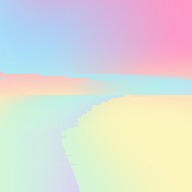

<div align="center">



# pixel-sort

A configurable pixel sorting CLI and web tool. Pixel sorting is a glitch art technique that rearranges pixels within an image according to a chosen property — brightness, hue, saturation, and more — producing streaked, smeared, and distorted visual effects.

|              Original              |                 Sorted                  |
| :--------------------------------: | :-------------------------------------: |
|  |  |

</div>

## Install

```bash
npm install
npm run build
```

To use as a global command:

```bash
npm link
```

## Usage

```bash
pixel-sort <input> [options]
# or without linking:
node dist/index.js <input> [options]
```

The input image is never modified. Output is written to a new file named after the input with the active options appended (e.g. `photo_h_bri_thr_0.25-0.8.jpg`), or to a path you specify with `-o`.

## Options

| Flag              | Default      | Description                                                                                             |
| ----------------- | ------------ | ------------------------------------------------------------------------------------------------------- |
| `-d, --direction` | `horizontal` | Sort direction: `horizontal` \| `vertical` \| `both` \| `radial` \| `spoke`                             |
| `-k, --key`       | `brightness` | Property to sort by: `brightness` \| `hue` \| `saturation` \| `lightness` \| `red` \| `green` \| `blue` |
| `-m, --mode`      | `threshold`  | How to define sortable intervals: `threshold` \| `full` \| `random`                                     |
| `--lo`            | `0.25`       | Lower brightness bound for `threshold` mode (0–1)                                                       |
| `--hi`            | `0.8`        | Upper brightness bound for `threshold` mode (0–1)                                                       |
| `-r, --reverse`   | `false`      | Sort in descending order                                                                                 |
| `--max-len`       | `200`        | Maximum interval length in pixels for `random` mode                                                     |
| `--seed`          | —            | Integer seed for the `random`-mode PRNG. Omit for a different result each run                           |
| `--cx`            | `0.5`        | Focal point X for `radial` / `spoke` directions, normalised 0–1                                         |
| `--cy`            | `0.5`        | Focal point Y for `radial` / `spoke` directions, normalised 0–1                                         |
| `--channel`       | `all`        | Isolate one colour channel: `all` \| `red` \| `green` \| `blue`                                         |
| `--exclude`       | —            | Protect a rectangle from sorting: `x1,y1,x2,y2` in pixel coordinates (inclusive)                        |
| `--invert-mask`   | `false`      | Reverse the exclude mask — sort **only** inside the rectangle instead of outside it                     |
| `-o, --output`    | auto         | Output file path                                                                                        |

### Interval modes

- **`threshold`** — only sorts runs of pixels whose brightness falls within `[--lo, --hi]`. Pixels outside the range act as boundaries, preserving the structure of very dark or very bright areas. This is the classic pixel sort effect.
- **`full`** — sorts the entire row or column as one interval. Produces a fully sorted, rainbow-like streak across the image.
- **`random`** — splits each row/column into random-length intervals (up to `--max-len` pixels) and sorts each one independently. Produces a choppier, more fragmented effect. Pass `--seed` to make the output reproducible — the same seed always produces the same interval pattern.

### Sort keys

| Key                      | Sorts by                                         |
| ------------------------ | ------------------------------------------------ |
| `brightness`             | Perceived luminance `(0.299R + 0.587G + 0.114B)` |
| `hue`                    | HSL hue (color wheel position)                   |
| `saturation`             | HSL saturation (color intensity)                 |
| `lightness`              | HSL lightness                                    |
| `red` / `green` / `blue` | Raw channel value                                |

### Radial and spoke directions

- **`radial`** — groups pixels into concentric rings based on their distance from a focal point, then sorts each ring. Produces circular, halo-like streaks radiating outward.
- **`spoke`** — groups pixels into lines radiating outward from a focal point and sorts each line from centre to edge. Produces a starburst or sunray effect.

Use `--cx` and `--cy` (both 0–1, default `0.5`) to move the focal point away from the centre.

### Channel isolation

`--channel red/green/blue` sorts only that channel's values while leaving the other two channels frozen at their original pixel positions. The sort order is still determined by the chosen `--key` — it's the write-back that is filtered, not the ranking. This produces chromatic-aberration and colour-shift effects that aren't possible by sorting full pixels.

`--channel all` (the default) is equivalent to the standard behaviour where the full pixel moves.

### Exclude mask

`--exclude x1,y1,x2,y2` protects a rectangular region from sorting. By default the area inside the rectangle is left untouched and everything outside is sorted normally. Adding `--invert-mask` flips this — only pixels inside the rectangle are sorted, everything outside is left untouched.

## Examples

```bash
# Default: horizontal, brightness, threshold
pixel-sort photo.jpg

# Vertical sort by hue across full columns
pixel-sort photo.jpg -d vertical -k hue -m full

# Both directions, sort by saturation, tight threshold
pixel-sort photo.jpg -d both -k saturation --lo 0.4 --hi 0.7

# Random intervals, reversed sort, custom output path
pixel-sort photo.jpg -m random --max-len 300 -r -o out.png

# Random intervals with a fixed seed — reproducible and shareable
pixel-sort photo.jpg -m random --max-len 150 --seed 42

# Full horizontal sort by red channel
pixel-sort photo.jpg -k red -m full

# Protect a subject in the centre from sorting (cols 400–800, rows 200–600)
pixel-sort photo.jpg --exclude 400,200,800,600

# Sort ONLY within a region (isolate the effect to one area)
pixel-sort photo.jpg --exclude 400,200,800,600 --invert-mask
```

## Web UI

A browser-based version lives in `web/`. It runs entirely client-side — images are never uploaded; all processing happens in the browser via the Canvas API.

```bash
cd web
npm install
npm run dev   # http://localhost:3000
```

To deploy on Vercel, import the repo and set the **root directory** to `web/`.

### Web dev commands

```bash
npm run lint          # ESLint
npm run lint:fix      # ESLint with auto-fix
npm run format        # Prettier
npm run format:check  # Prettier check (CI)
npm run test          # Vitest
npm run test:watch    # Vitest watch mode
```

## CLI Development

```bash
npm run dev -- photo.jpg [options]    # run via ts-node without building
npm run build                         # compile to dist/
npm run lint                          # ESLint
npm run lint:fix                      # ESLint with auto-fix
npm run format                        # Prettier
npm run format:check                  # Prettier check (CI)
npm run test                          # Mocha
npm run test:coverage                 # nyc
```

## Supported formats

JPEG, PNG, BMP, GIF, TIFF (via [jimp](https://github.com/jimp-dev/jimp)).
